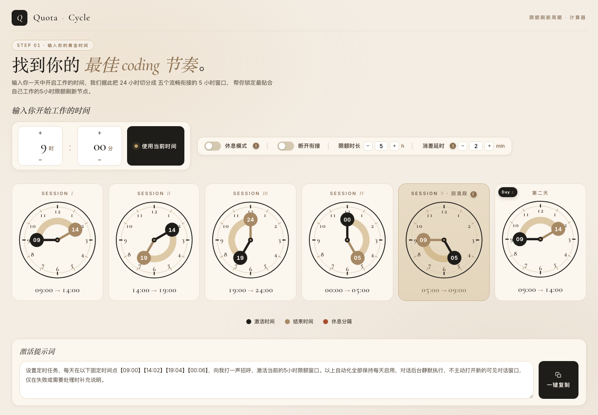

# Quota Cycle · 限额刷新周期计算器

> 📘 英文版 / English version: [README_EN.md](README_EN.md)

> ⭐ **喜欢这个项目？** 去 [GitHub 点个 Star](https://github.com/quantong1990/quota-cycle) 支持一下，也能帮更多人发现它。

> 输入你一天开启工作的时间，自动算出一天里每个「限额窗口」的最佳刷新时间点，并生成可直接交给 AI Agent 执行的自动化提示词。



*页面效果 — 默认 09:00 起点，把 24 小时切分为五个衔接的 5 小时限额窗口，并实时生成可一键复制的激活提示词。*

---

## 背景

Codex、Claude Code 等 Agent 的订阅都按**滚动 5 小时窗口**计量：窗口从你的第一条消息开始计时，而不是从你坐下干活开始。于是常出现尴尬局面——工作三小时就用完额度，却只能干等两小时等窗口重置。

**Quota Cycle** 把这个问题产品化：以 24 小时表盘为单位，把一天切成若干衔接的限额窗口，并输出一段**激活提示词**——交给后台 Agent，让它每天在固定时间点打招呼、激活新的限额窗口即可。

---

## 使用场景

> Codex 和 Claude Code 等 Agent 的订阅都按滚动 5 小时窗口计量，窗口从你的第一条消息开始计时，而不是从你坐下干活开始。不想工作三小时就用完额度、只能白白干等两小时的尴尬情况，下面的限额激活方式就非常适合你：

1. **你习惯 9 点开始工作。** Agent 会自动在 7:00 发第一条消息激活窗口（7:00–12:00）。9 点工作到 12 点午饭休息，相当于 3 小时里用满 5 小时的额度。
2. **12 点–14 点，午饭午休。** Agent 会自动在 12:00 发第二条消息激活窗口（12:00–17:00）。14 点开始工作到 17 点，同样 3 小时里用满 5 小时的额度。
3. **17 点–19 点，该下班吃晚饭了。** Agent 会自动在 17:00 发第三条消息激活窗口（17:00–22:00）。此时无论你是计划下班回家，还是选择加班到八九点，都可以在这段时间畅用新的 5 小时窗口。
4. **22 点，你回到家洗漱完。** Agent 会自动在 22:00 发第四条消息激活窗口（22:00–03:00）。此时你还有些事情想处理，或者想用 AI 做点什么，都可以拥有新的 5 小时窗口。
5. **凌晨深夜，你已经睡了。** Agent 会默默等待，不随便激活，直到第二天 7:00，又是额度满满的一天！

* 提示词为了确保不被网络波动影响激活，每段激活时间会向后延迟2分钟，即 【07:00】【12:02】【17:04】【22:06】。

> 这套节奏对应的工具设置：开始时间 **7:00**、限额时长 **5 小时**、消差延时 **2 分钟**，提示词即生成上面的 `【07:00】【12:02】【17:04】【22:06】`。

---

## 核心功能

- **限额时长可调**：2–12 小时，默认 5 小时。
- **24 小时自适应填充**：完整窗口不足 6 个时循环重复（第一个重复标「第二天 Day 2」）；多出 1 段用「回流段」收尾（不激活，让精力回血）；窗口数超过 6 个时自动换行。
- **断开衔接模式**：关闭时 24 小时自动首尾衔接；开启后 5 个 Session 各自独立，可单独拖动任意时钟而不影响其它。
- **休息模式**：提前激活 Agent，前 N 小时休息、后段集中输出，把 5 小时窗口压缩成更短的有效工作段。
- **指针可拖动**：直接拖时钟上的黑针（激活）/ 金针（结束）/ 红针（休息分隔）来平移窗口。
- **消差延时（stagger）**：提示词里第 i 个激活点 = 窗口起点 + i × 延时（默认 2 分钟），给激活留缓冲，避免上一个窗口尚未释放、下一个激活因延迟而失败。
- **激活提示词实时生成 + 一键复制**：时间随时钟联动、回流段自动跳过；提示词可手动修改，复制按钮复制框内全部内容。

### 提示词示例

默认 09:00 / 5h / 消差延时 2min 时：

```
设置定时任务，每天在以下固定时间点【09:00】【14:02】【19:04】【00:06】，向我打一声招呼，激活当前的5小时限额窗口。以上自动化全部保持每天启用，对话后台静默执行，不主动打开新的可见对话窗口，仅在失败或需要处理时补充说明。
```

消差延时调到 5 分钟时，对应变为 `【09:00】【14:05】【19:10】【00:15】`（见上文使用场景的 7:00 版本）。

---

## 使用方法

1. 在「输入你开始工作的时间」设置起点；
2. 按需开关 **休息模式** / **断开衔接**，调节 **限额时长** 与 **消差延时**；
3. 拖动时钟指针微调窗口；
4. 页面底部的「激活提示词」会自动跟着变，点 **一键复制** 即可交给你的 Agent。

---

## 本地运行

纯静态页面，零依赖、无构建步骤。**任选其一：**

- 直接双击 `index.html` 用浏览器打开即可；
- 或起一个本地静态服务器：
  ```bash
  cd quota-cycle
  python3 -m http.server 8765
  # 浏览器访问 http://localhost:8765/
  ```

### 运行测试

```bash
node test.js
```

逻辑部分用 Node 做断言测试（窗口切分、回流段、循环重复、激活时间生成等）。

---

## 技术栈

- 纯 **HTML + CSS + 原生 JS**，无框架、无打包工具；
- 时钟与高亮弧使用内联 **SVG** 绘制；
- 状态与渲染分离，`state` 单一数据源驱动整页重绘；
- 提示词时间令牌采用「原地替换」策略，用户手动改过文案后，调时钟只更新时间、保留其它文字。

---

## 项目结构

```
quota-cycle/
├── index.html    # 页面结构（选项区 / 时钟容器 / 提示词区）
├── style.css     # 暖米色视觉风格与布局
├── app.js        # 状态、SVG 时钟渲染、拖动、提示词生成逻辑
├── test.js       # 纯逻辑单元测试（node test.js）
├── README.md     # 中文说明（默认）
└── README_EN.md  # English documentation
```

目录说明:
- `index.html` — 页面结构（选项区 / 时钟容器 / 提示词区）
- `style.css` — 暖米色视觉风格与布局
- `app.js` — 状态、SVG 时钟渲染、拖动、提示词生成逻辑
- `test.js` — 纯逻辑单元测试（`node test.js`）
- `README.md` — 中文说明（默认）
- `README_EN.md` — 英文说明

---

## 在线演示

- 实时预览：https://quantong1990.github.io/quota-cycle/
- 源码仓库：https://github.com/quantong1990/quota-cycle

---

## 备注

本项目为个人效率工具，用于演示「把计费窗口节奏产品化、并用 Agent 自动化执行」这一思路。如果你也在做 AI 产品方向相关工作，欢迎交流。
